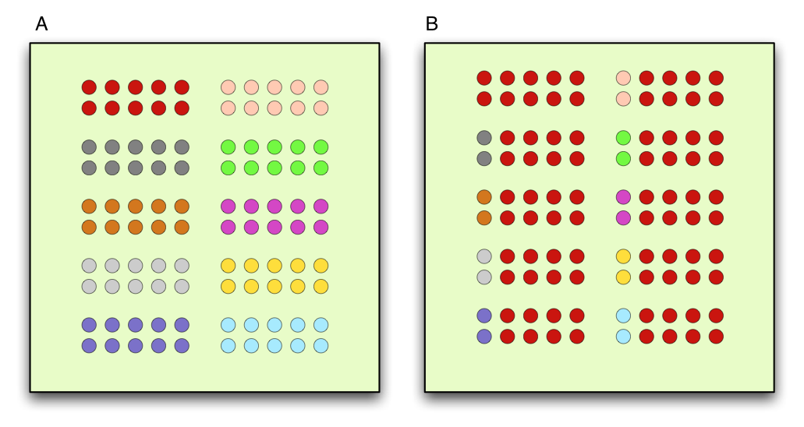

```{r setup, include=FALSE}
knitr::opts_chunk$set(echo = TRUE)
```

## Goal: Learn fundamental alpha diversity metrics, and how to visualize them

Today, we will do some surface analysis on the 16S data you worked on last time. We will work mostly in phyloseq, which is a great package for visualizing community data. Throughout this analysis, we work towards answering the following question:

How does diversity change in these communities over time? In terms of time across transfers, and time within a transfer.


## Dataset

We are working with the same dataset as last lesson. However, I have rerun the analysis on every sample and have sent you my outputs for that run.

## Excercise
# Load packages and data.

```{r}
library(phyloseq)
library(ggplot2)
library(RColorBrewer)

tax <- read.csv("taxonomy.csv", header=TRUE, row.names=1)
counts <- read.csv("counts.csv", header=TRUE, row.names = 1)
metadata <- read.csv("metadata.csv", header=TRUE)
```

You have three data files. What's in each one?

We need a manipulate our metadata file a bit. This file contains information about our samples that we can use to better visualise and analye the data. Currently, our variables like "source" and "day" are numeric, but we want to make them characters. That will make downstream graphing a lot easier. Lastly, we want to order our factors.

```{r}
#these three lines will make our numeric values into characters
metadata$source <- as.character(metadata$source)
metadata$day <- as.character(metadata$day)
metadata$broke <- as.character(metadata$broke)

#reorder our "source" variable so it graphs in an intuitive way
metadata$source <- factor(metadata$source, levels = c("56", "73", "94", "110"))

```

# Create phyloseq object

We are working exclusively with phyloseq this lesson, since it's so easy to use. In order to use the tools in phyloseq, we need to create a "phyloseq" object from our data.

```{r}
count.ps <- otu_table(as.matrix(counts),taxa_are_rows = TRUE) #define our count table as our otu table
tax.ps <- tax_table(as.matrix(tax)) #define our taxonomy table as a taxonomy table for phyloseq to use
meta.ps <- sample_data(metadata) #define our metadata as sample information
ps <- phyloseq(count.ps, tax.ps, meta.ps) #put them all together into a phyloseq object
```

# Alpha diversity

Before we begin plotting, let's talk about alpha diversity. Alpha diversity is a local measure of diversity or the average species/OTUs/ASVs diversity in a specific habitat or sample.

There are two main points when it comes to alphadiversity: richness and evenness. Richness refers simply to how many different species/OTUs/ASVs we have. Evenness is how even their distribution in that sample is.

[ from the web.](http://sciencebitz.com/?page_id=1186)

Both A and B have the same richness, or the same number of different things. However, A is more even than B because the different things are more evenly distributed.

When we analyze our dataset for alpha diversity, we want to choose diversity metrics that consider both evenness and richness in their calculation. I personally think it's best to use at least two diversity metrics. Below we will use the Chao1 index, and Shannon index. Chao1 is an index that places more weight on richness, while Shannon considers evenness.

Now, let's try to answer the question: How does diversity change across time in our dataset? We have two different timelines we can focus on: time across transfers, or time across sampling. To make analysis easier, let's focus on just richness.

# Plotting diversity metrics
```{r}
theme_set(theme_classic()) #set theme for graphs so they are pretty
plot_richness(ps,"day", color="day", measures=c("Chao1")) +
  facet_grid(. ~ source, scales="free_x")
```

Look at the graph, try to answer the following questions:

1) How does richness (Chao1) change across transfers? Does this make sense? You can just eyeball the values between transfers.

2) How does the richness (Chao1) change throughout one week within each community set? Are the changes consistent? If not, how do they compare?

3) Together, what do these observations say about how the microbial community is changing in richness? What can you conclude about the composition in terms of richness?


If you feel comfortable with your answers, feel free to move forward. Let's take a look at diveristy when evenness is considered.

```{r}
plot_richness(ps,"day", color="day", measures=c("Shannon")) +
  facet_grid(. ~ source, scales="free_x")
```

1) How does evenness change across transfers? Does this make sense? You can just eyeball the values between transfers.

2) How does the evenness change throughout one week within each community set? Are the changes consistent? If not, how do they compare?

3) What can you conclude about the composition of this community across transfers, and within a week? What do you think that says about the biology of this system?

# Plotting the relative abundance

I think it's important to evaluate the alpha diversity of a dataset before moving onto relative abundance graphs. By examining how the community holistically changes over time, we can get a sense of what to expect from the relative abundance data - which can often be overwhelming to look at.

Again, we will use phyloseq to plot this data. Before we begin, we will need to take our abundance data and turn it into relatve abundance. We also want to only graph the 20 most abundant microbes (or anything less that the 70-ish unique genera we have now) for easier visualization. Most of the groups are less than 1% abundant so they would not impact the graph much.

```{r}

top20 <- names(sort(taxa_sums(ps), decreasing=TRUE))[1:20] #store value of 20 most abundance ASVs
ps.top20 <- transform_sample_counts(ps, function(OTU) OTU/sum(OTU)) #format data into relative abundance
ps.top20 <- prune_taxa(top20, ps.top20) #create a new phyloseq object with only the top 20


colorCount <- 20 #remember this code? I'm storing the value 20, because we're only looking at 20 groups.
getPalette = colorRampPalette(brewer.pal(12, "Set3")) #worth noting that this palette isn't perfect. We have so many groups that some colors will inevitably look too similar. Still better than a gradient palette though.

```

Our data is formatted, and our color palette has been set. Let's take a look! Zoom in on your graph if that helps.

```{r}
plot_bar(ps.top20, x="sample", fill="Genus") + #initialie graph
  geom_bar(aes(fill= Genus), stat = "identity", position="stack") + #specify a stacked bar graph
  scale_fill_manual(values=getPalette(colorCount)) + #our colors
  theme(legend.position="bottom") + #move legend to bottom
  facet_grid(. ~ source, scales = "free_x") #split up data by community so we can see more easily
```

1) Does this data support your conclusions from the observing the Chao1 and Shannon diversity indices?

2) Why don't these relative abundance bars reach all the way up to 1?

3) Describe how the most abundant genus is changing across time within each transfer. Do the dynamics differ across transfers?

4) What do this data suggest about community succession in this system?
