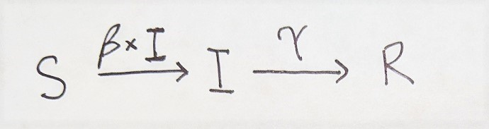
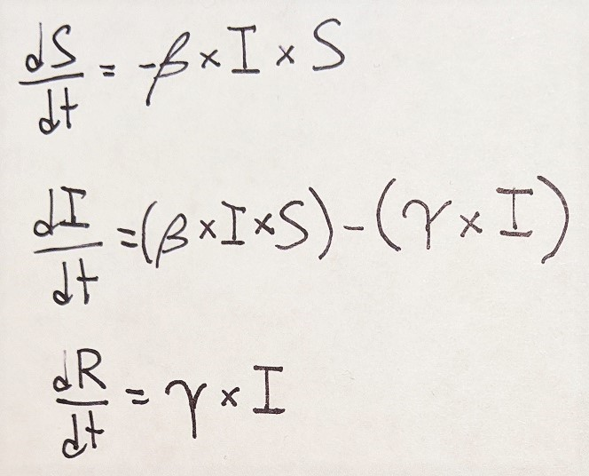

```{r setup, include=FALSE}
knitr::opts_chunk$set(echo = TRUE)
```

## Goal: Run simulations in R.

Goal 1: Understand the SIR model and its assumptions.

Goal 2: Familiarize yourself with writing functions and running simulations in R.

## SIR Model

The SIR model can be graphically summarized below: susceptible people (S) get infected at a rate that's equal to the product of contact rate (β) and the number of infected people (I). Infected people recover at rate γ.

<center>

</center>

Every model has a set of assumptions. The SIR model has three:

- The population is closed. This model does not consider birth rates, the only way to change the number of S people is for the to move through I and R.
- All individuals are equivalent (no considerations for age, gender, healthcare access, etc). The only differences between people is their disease state.
- The population is homogenously mixed: everyone can contact everyone.

Obviously, these assumptions do not hold up to real life situations. However, these assumptions are made to simplify a model, which makes writing and interpreting them easier. We can build models as complex as we like, but writing models often requires us to compromise between complexity and tractability.

Let's take a look at the differential equations that represent the SIR model.

<center>

</center>

Each equation describes the rate of how many people in each disease state (susceptible, infected, or recovered) changes over time. 

1) I want to ensure you understand each equation. Can you verbally describe what each equation describes? You can reference the graphic model and the written description above to help. In your answer, refer to them simply as "dS", "dI", or "dR".

Once you're comfortable with your answer, move forward to writing code.

## Writing SIR functions

You've written functions in R before, so the code may look familiar. However, these are a little different because we will eventually use them to run simulations. We need to do several things: write out the SIR differential equations (dS, dI, dR), write a list of our variables (disease states), and write a list of our parameters (β and γ.)


```{r}
#write diff eqs
sir <- function(time, state, parameters) {
  with(as.list(c(state, parameters)), {
    dS <- -beta * I * S
    dI <- beta * I * S - gamma * I
    dR <- gamma * I
    return(list(c(dS, dI, dR)))
  })
}
```


```{r}
#write state variables
initial_state <- c(S=999, #Starting population of 999 susceptible people
                   I = 1, #Start with 1 infected person.
                   R = 0) #Nobody has recovered from the disease yet.


#define parameters

parameters_val <- c(beta= 0.003, #arbitrary made up number
                    gamma= 0.6) #arbitrary made up number

#specify time values
time_val <- seq(0, 10) #days
```

Once you have your function, parameters, and variables defined we can solve them using ode() from the deSolve package.

```{r}
library(deSolve) #load package


run1 <- ode(  #run ode() on our functions, store solutions into new object
  y= initial_state,
  times = time_val,
  func = sir,
  parms = parameters_val
)

run1 #check on solutions

```

Let's graph our results.

```{r}
library(ggplot2)
library(magrittr)

run1.df <- as.data.frame(run1) #turn output into data frame for easier graphing

theme_set(theme_classic()) #make pretty

plotmaker <- function(...){
  return(... %>%
           ggplot(aes(x=time))+ #initialize graph
           geom_line(aes(y=S, color="Susceptible"))+ #draw S curve
           geom_line(aes(y=I, color="Infected"))+ #draw I curve
           geom_line(aes(y=R, color="Recovered")) + #draw R curve
           scale_color_manual(breaks=c("Susceptible","Infected","Recovered"), #manually specify colors
                              values=c("#999999","#E69F00","#56B4E9"))+
           ylab(label="Number of people")+
           xlab(label="Time (days)"))
}

p1 <- plotmaker(run1.df)
p1
```


3) On what day does the "Infected" state peak? How many people have recovered by day 10? 

## Write SIR simulator

We have simulated the SIR model with arbitraty numbers, however, we want to change our parameters to understand how they interact and change the model's predictions. Instead of manually changing our parameters and manually graphing the results, let's write a simulator that takes whatever paramters we give it and outputs a graph with the plotmaker function written above.

```{r}

sir_sim <- function(beta, gamma, S0, I0, R0, time) {
  require(deSolve) # because we need the ode() function
  
  # diff eqs, this should be identical to the functions you wrote above
  sir <- function(time, state, parameters) {
    with(as.list(c(state, parameters)), {
      dS <- -beta * I * S
      dI <- beta * I * S - gamma * I
      dR <- gamma * I
      return(list(c(dS, dI, dR)))
    })
  }
  
  # the parameters values:
  parameters_values <- c(beta  = beta, gamma = gamma)
  
  # the initial values of variables:
  initial_values <- c(S = S0, I = I0, R = R0)
  
  # solving
  output <- ode(initial_values, time, sir, parameters_values)
  
  # returning the output:
  output.df <- as.data.frame(output)
  
  #plot
  plotmaker(output.df)
}


sir_sim(beta = 0.003, gamma = 0.6, S0= 999, I0 = 1, R0 = 0, time = seq(0,10)) #run with parameters from before. The results should be identical to our previous run.

```

Let's play with the parameters to understand what they do to the model.

4) Change β, and record what you change it to. Rerun the sir_sim() with the changed parameter. How does the Infected curve behave compared to run1? When does the Infected curve peak? Depending on what your change β to, you may have to change the timescale as well.

5) Change β back to 0.003, and change γ. Record what you change it to. Follow a similar analysis above. How does the Recovered curve behave compared to run1? Depending on what your change γ to, you may have to change the timescale as well.

6) You've probably heard people (Cameron) talk about "R<sub>0</sub>", or R nought" or "R zero." This value is the basic reproduction number of an infection and describes how transmissible it is. A larger value means the infection is more transmissible. R<sub>0</sub> is calculated by dividing β by γ. Calculate the R<sub>0</sub> for our first run of the simulation, your run for question 5, and your run for question 6.Do the R nought values make sense with the way their respective graph behaves?

Continue messing with β and γ to your heart's content.

7) How do you think your graphs would change if did not accept one (or more) of the SIR model's assumptions. For example, if the population is open how would the curves behave if you allowed birth and/or deaths? What could if there are subpopulations that do not contact?

Simulations are useful for making predictions, but those predictions aren't as useful without real data. Let's revisit the SIR model next lesson. We will use covid-19 data, since it seems like the most relevant infectious disease at this time.
